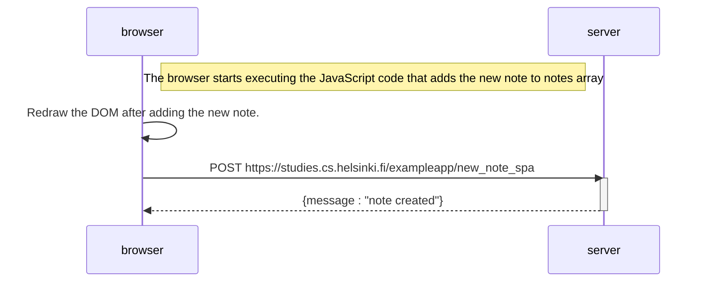

## Diagram of adding new note to notes page with _Single Page Application Style_

```mermaid
sequenceDiagram
    participant browser
    participant server

    Note right of browser: The browser starts executing the JavaScript code that adds the new note to notes array
    browser->>browser: Redraw the DOM after adding the new note.

    browser->>server: POST https://studies.cs.helsinki.fi/exampleapp/new_note_spa
    activate server
    server-->>browser: {message : "note created"}
    deactivate server
```
